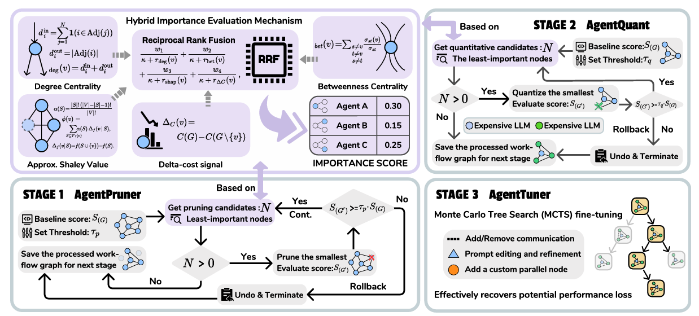

# AgentSlimming: Towards Efficient and Cost-Aware Multi-Agent Systems

[](https://openreview.net/pdf?id=nrZRbXMyzi)


AgentSlimming is a research framework for optimizing graph-structured LLM agent workflows. It searches over executable workflow graphs, evaluates them on task benchmarks, and then reduces cost with pruning, quantization, and optional finetuning.

The implementation is centered on `GraphFlow`: a directed acyclic graph of nodes connected by typed edges. Generated workflows are stored as compact Python artifacts under `workspace/<dataset>/...`, while common execution and node behavior live in `src/core/`.

Short notes:

- This repository started from an AFlow-derived codebase and has since been substantially refactored.
- The exploration style of the MCTS pipeline can be steered significantly by the optimizer prompt in `src/prompts/`.
- Nodes support an optional `count_towards_cost` boolean (default `True`) that lets you exclude a node's LLM usage from the final cost summary; set it in the generated `graph.py` node constructor.
- This repository went through a large refactor before open-sourcing. We cannot guarantee that every path has been extensively tested yet. If you hit issues, please open an issue or send a PR.

<p align="center">
  
</p>

Terminology in this repository:

- `mcts`: graph/prompt search over executable workflows.
- `prune`, `quantize`, and `finetune` are inspired by neural-network optimization terminology, but here they operate on agent workflows rather than model weights.
- `prune`: removes workflow nodes or paths to simplify the execution graph, rather than pruning neural network parameters.
- `quantize`: replaces selected workflow nodes with a cheaper model to reduce execution cost, rather than quantizing numeric weights or activations.
- `finetune`: runs another MCTS-style workflow optimization stage starting from quantized workflows, rather than updating a base model with gradient-based finetuning.

## Supported Tasks

- QA: `DROP`, `HotpotQA`, `MusiqueAns`
- Math: `GSM8K`, `MATH`, `AIME`
- Code generation: `HumanEval`, `MBPP`, `LiveCode`

Task registration is in `src/catalog/datasets.py` and benchmark implementations live under `benchmarks/`.
The dataset catalog is the single source of truth for CLI support, evaluator selection, and dataset file resolution.

## Quick Start

1. Create a Python environment and install dependencies:

```bash
python3.11 -m venv .venv
source .venv/bin/activate
pip install -U pip
pip install -r requirements.txt
```

2. Create a local model config:

```bash
cp config/config.example.yaml config/config.yaml
```

3. Fill in `base_url`, `api_key`, and token prices for the models you plan to use.

4. Run one pipeline:

```bash
python -m src.cli.run \
  --config config/config.yaml \
  --dataset MATH \
  --pipelines mcts \
  --workspace workspace \
  --max_rounds 10 \
  --sample 4 \
  --opt_model_name gpt-4.1 \
  --exec_model_name gpt-4.1-mini
```

## Data And Reporting

Evaluation reads local JSONL files under `data/datasets/`. Small fixtures are tracked in git; the larger integrations are prepared locally by `data/download.py`:

```bash
python -m data.download
```

Some integrations intentionally use repository-local splits or reporting protocols rather than the official benchmark setup, especially `AIME`, `LiveCode`, and the `MusiqueAns` / `MuSiQue-Ans` path. Treat those numbers as local experiment results unless you rerun the official benchmark evaluation. Exact file policy, downloader behavior, and reporting caveats live in [docs/data.md](docs/data.md).

## Documentation

- [docs/setup.md](docs/setup.md): install, config resolution, repository layout
- [docs/running.md](docs/running.md): CLI entrypoints, pipeline flags, wrapper scripts
- [docs/workflows.md](docs/workflows.md): generated workflow files, node registration, workspace layout
- [docs/data.md](docs/data.md): dataset files, download policy, split/reporting caveats
- [docs/demo-and-eval.md](docs/demo-and-eval.md): tracked `MATHDEMO` seed and standalone workflow evaluation

## License

This repository is released under the [MIT License](LICENSE). For upstream
attribution details, see [THIRD_PARTY_NOTICES.md](THIRD_PARTY_NOTICES.md).

## Safety

Code-generation benchmarks execute model-produced Python code through the local runner. Do not run untrusted workflows outside a restricted environment.

## Citation

If you use AgentSlimming in your research, please cite the ACL paper.

```bibtex
@inproceedings{agentslimming2026,
  title = {AgentSlimming: Towards Efficient and Cost-Aware Multi-Agent Systems},
  booktitle = {Proceedings of the Annual Meeting of the Association for Computational Linguistics},
  year = {2026}
}
```
